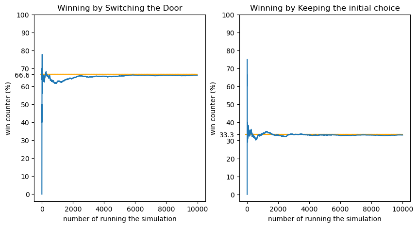

# Monty Hall Simulation

In this Python project, I developed a simulation based on the Monty Hall game. The game scenario involves three doors, one hiding a car and the other two concealing goats. Upon the contestant's initial selection, the host reveals one of the remaining doors with a goat, presenting the option for the contestant to switch their choice. The simulation demonstrates that switching doors yields a 66% chance of winning, compared to a 33% chance if the contestant keeps their initial selection. The project serves to empirically validate the statistical claims regarding the game's optimal strategy. 

## Project Structure

The project has the following structure:
```
.
|-- README.md
|-- src
    |--MontyHall.ipynb
    |--MontyHall.py
```
## Project Output
The output of the project demonstrates the frequency of winning outcomes when the contestant employs the strategy of switching doors across multiple simulations.


